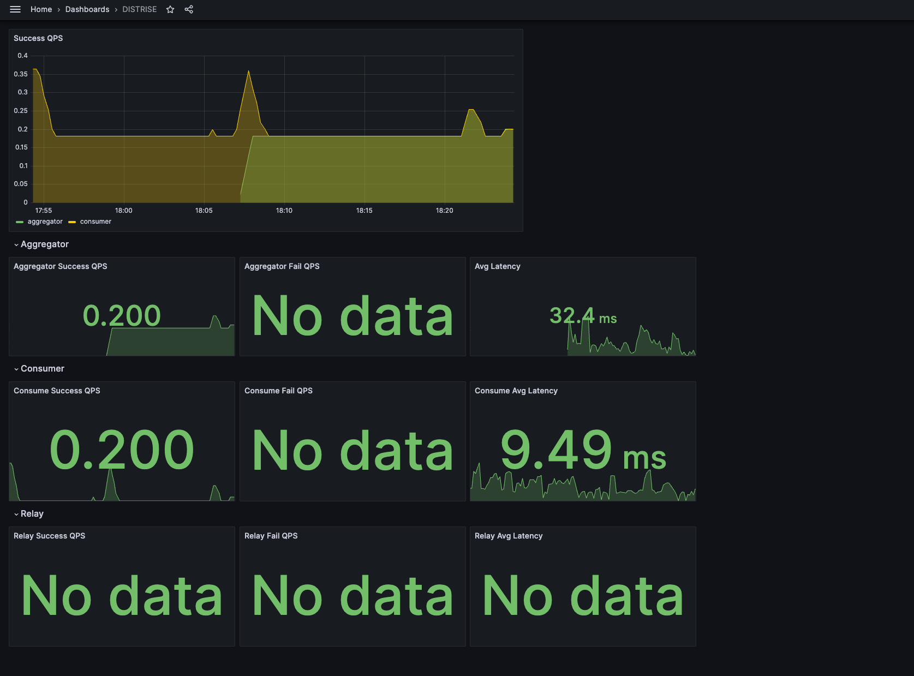

# Distributed Systems Project 

## How to run this Project on local
### Install tools
```bash
# auto watch file change and hot reload server
go get -u github.com/silenceper/gowatch

# install mockgen
go get -u github.com/golang/mock/mockgen

# install govulncheck
go install golang.org/x/vuln/cmd/govulncheck@latest
```

### View coverReport
```bash
go tool cover -html=coverage.out
```

### Docker Build
```bash
docker build --build-arg BUILD_DIR=cmd/aggregator -t aggregator -f build/dockerfile/Dockerfile .
docker run -d -p 8080:8080 aggregator    
```

## Phase 1
Building a simple nostr client

### Question Exercises
- What are some of the challenges you faced while working on Phase 1?
  - I didn't know Nostr very well, so it took me some time to understand it.
  - I spent some time debugging why there was no ACK response until I found out that our classmates had already discussed it on Discord. 


- What kind of failures do you expect to a project such as DISTRISE to encounter?
  - Misconfiguration caused DISTRISE to be unable to serve on time during a release change. 
  - High traffic has led to the service going down.


## Phase 2
Building Your Own Relay

### Question Exercises
#### **Challenges you faced while working on Phase 2**
  - Because I still don't quite understand how relay servers work, combined with the fact that my client has a bug, it has led to consistent errors in the authentication process.  
  - Originally, I want to create a CockroachDB in GKE. However I realized that the GCP is more complex than I anticipated, and I lack sufficient knowledge about public cloud systems. As a result, I decided to create a PostgresDB on Cloud SQL instead. 


#### **Why did you choose this database?**
  - This project is a small project, so I have chosen PostgreSQL as my option.

#### **If the number of events to be stored will be huge, what would you do to scale the database?**

I believe we need to consider the following topics:
- Capacity and indexing: As the size of events grows rapidly, it can become a challenge to handle the indexing of these events efficiently. Replication delays can also impact the t the speed of reading data.
- Traffic: High traffic can significantly impact the performance of our database, potentially leading to busyness or even downtime.

To address these issues, we can consider implementing the following strategies:
- Table splitting: If a particular table becomes excessively large, we can split it into smaller tables through service splitting. This approach helps distribute the data and improve performance.
- Database sharding: By splitting the database into different zones or areas, we can distribute the workload and enhance scalability.
- Archiving cold data: Moving infrequently accessed or cold data to long-term storage can help free up space in the database and improve performance.
- Migrating to scalable databases: Considering a shift to databases like CockroachDB or CassandraDB can provide better scalability and handle larger volumes of data and traffic.

## Phase 3
Event Fetching and Persistence

### Question Exercises
#### **Why did you choose this database? Is it the same or different database as the one you used in Phase 2? Why is it the same or a different one?**
It's the same because I think it's enough for this project, but I want to use another database. When I have time, I want to migrate it.
#### **If the number of events to be stored will be huge, what would you do to scale the database?**
I will split the table first. As the events are still huge. I prefer to shard the database initially. The third strategy is to migrate the database to a cluster.

## Phase 4
Event Aggregation and Queuing

### Question Exercises
#### **Why did you choose this solution?**
I chose the GCP Pub/Sub solution because it's integrated in GCP, and I deployed my service on Cloud Run for easier management.
#### **If the number of events to be stored will be huge, what would you do to scale your chosen solution?**
I will scale both my event aggregator and aggregator consumer. Currently, we have a queue in place, which allows for easy scalability. However, if our database cannot handle the incoming traffic, we can reduce the scale of the consumer and relieve the pressure on the database.

## Phase 5 
Instrumentation and Preparations for Live Load Testing

### Question Exercises
#### **Why did you choose these 5 metrics?**
- successTotal: This metric counts the number of successful processing events. It helps us track the success rate of each component. 
- failTotal: This metric counts the number of failed processing events. It allows us to monitor errors and failures that occur during different stages of processing and within each component.
- processDuration: This metric measures the duration of processing. It provides insights into the processing time.
- websocketConnectionNumber: This metric counts the number of WebSocket connections connected to the relay.

[Grafana Dashboard Template](scripts/metrics/grafana-dashboard/DISTRISE.json)
#### **What kind of errors or issues do you expect them to help you monitor?**
When the failure rates are increasing, the success count becomes zero or the average latency is rising, it indicates that something is wrong, and we need to identify the root cause.
#### **If you had more time, what other tools would you use or metrics would you instrument and why?**
I will try using GCP solutions, such as Cloud Mertics, because it seems very convenient to have everything on the same GUI.

## Demo
